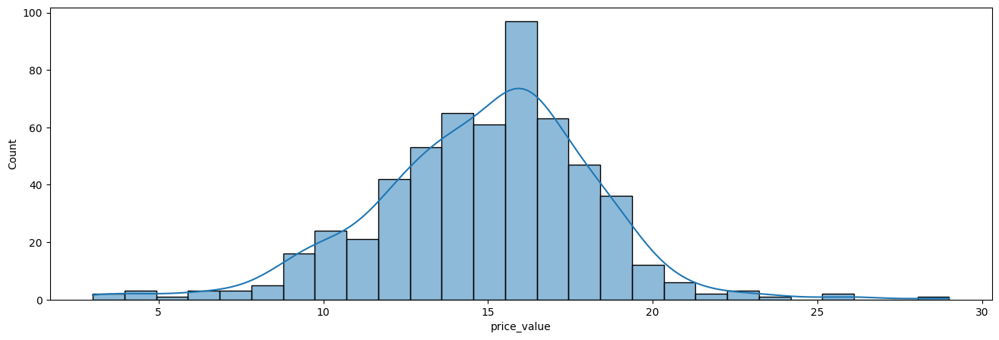

# Portofolio: Binary Classification Analysis - Understanding Customer Churn Using Predictive Analysis Approach

# Business Understanding

## Introduction

The fitness center is facing a challenge with customer retention. After offering a 99% discount for the first month, a significant number of customers choose not to continue their subscriptions. To address this, the marketing team has created a questionnaire aimed at gathering insights from customers willing to spend 10 to 15 minutes sharing their feedback. The goal is to understand the factors influencing customer retention and improve decision-making to reduce churn.

## Objectives

This project aims to predict customer retention by identifying whether or not customers will continue their subscription after the discounted period. Additionally, we will explore the factors that most significantly contribute to customer retention, enabling the fitness center to make data-driven decisions to enhance customer loyalty and reduce churn rates.

## Tools and Dataset Needed

To carry out this analysis, the project will utilize Python and its powerful libraries such as NumPy, Pandas, Matplotlib, Seaborn, Scikit-learn, and XGBoost. The dataset consists of responses from customers who completed the marketing questionnaire, providing valuable information on customer behavior, preferences, and potential reasons for discontinuing their subscription.

## Methodology

The analysis will employ a binary classification approach, predicting whether customers will continue their subscription (0) or churn (1). Given the size of the dataset (less than 100,000 samples), ensemble methods such as Random Forest and Gradient Boosting are chosen, as they are robust to outliers and can effectively capture complex patterns in the data.

# Data Understanding

## Data Acquisition


```python
import numpy as np
import pandas as pd
import matplotlib.pyplot as plt
import seaborn as sns
import warnings
warnings.filterwarnings("ignore")
```


```python
dataset = pd.read_csv('data/fitness_churn.csv')
print(dataset.head())
```

       distance (km)  visit  price_value  height  weight  equipment  \
    0            0.6     11           16     175      85          8   
    1            0.5     10           16     174      80          8   
    2            0.3     15           21     172      93          7   
    3            0.5     11           17     169      74          8   
    4            0.2     15           20     166     103          7   
    
            platform extention  gender  
    0         tiktok  continue    male  
    1         tiktok  continue  female  
    2       linkedin  continue  female  
    3        youtube  continue    male  
    4  search engine  continue    male  
    

## Data Profiling


```python
# dataset info
dataset.info()
```

    <class 'pandas.core.frame.DataFrame'>
    RangeIndex: 569 entries, 0 to 568
    Data columns (total 9 columns):
     #   Column         Non-Null Count  Dtype  
    ---  ------         --------------  -----  
     0   distance (km)  569 non-null    float64
     1   visit          569 non-null    int64  
     2   price_value    569 non-null    int64  
     3   height         569 non-null    int64  
     4   weight         569 non-null    int64  
     5   equipment      569 non-null    int64  
     6   platform       569 non-null    object 
     7   extention      569 non-null    object 
     8   gender         569 non-null    object 
    dtypes: float64(1), int64(5), object(3)
    memory usage: 40.1+ KB
    


```python
# missing values
dataset.isna().sum()
```


    distance (km)    0
    visit            0
    price_value      0
    height           0
    weight           0
    equipment        0
    platform         0
    extention        0
    gender           0
    dtype: int64


```python
# duplicated values
dataset.duplicated().sum()
```


    np.int64(0)


```python
# correct wrong format
```

Because the sample is less than 100K, I'm afraid that we can only choose few models to compare.

## Descriptive Statistics


```python
print(dataset.describe())
```

           distance (km)       visit  price_value      height      weight  \
    count     569.000000  569.000000   569.000000  569.000000  569.000000   
    mean        0.710018   12.239016    14.889279  170.597540   85.256591   
    std         0.395825    4.702691     3.320875    3.759223   11.460168   
    min         0.200000    1.000000     3.000000  157.000000   46.000000   
    25%         0.500000   10.000000    13.000000  169.000000   78.000000   
    50%         0.600000   12.000000    15.000000  171.000000   84.000000   
    75%         0.800000   14.000000    17.000000  173.000000   91.000000   
    max         3.000000   75.000000    29.000000  190.000000  130.000000   
    
            equipment  
    count  569.000000  
    mean     7.641476  
    std      1.798308  
    min      1.000000  
    25%      7.000000  
    50%      8.000000  
    75%      9.000000  
    max     17.000000  
    


```python
def visualize(x, types):
    if types == 'numeric':
        plt.figure(figsize=(16,5))
        sns.histplot(x, kde=True)
        plt.show()
        
        plt.figure(figsize=(16,5))
        sns.boxplot(x=x)
        plt.show()

    elif types == 'categorical':
        plt.figure(figsize=(16,5))
        sns.barplot(x, errorbar=None, orient='h')
        plt.show()
```

### Numeric


```python
visualize(dataset['distance (km)'], 'numeric')
```


    

    


    

    


We see that the customers mostly come from the near area of the fitness center for each branches.


```python
visualize(dataset['visit'], 'numeric')
```


    

    


    

    


Normally days in one month is 30 days. Because it looks like 75 visits for one month, we can assume that they count visit per month, not day per month. There are two outliers that they visit the fitness center like three times a day for one month.


```python
visualize(dataset['price_value'], 'numeric')
```


    

    


    

    


because price value is an ordinal variable contains 3 questions scoring from 1 to 10 and they sum up, the lowest value would be 3. To me, the shape looks good with few outliers. It looks like gaussian.


```python
visualize(dataset['height'], 'numeric')
```


    

    


    

    


The data looks like normally distributed.


```python
visualize(dataset['weight'], 'numeric')
```


    

    


    

    


The outliers seems a lot in upper 110 rather than below 60.


```python
visualize(dataset['equipment'], 'numeric')
```


    

    


    

    


The customers mostly use 8 equipments for their exercise.

### Categorical


```python
visualize(dataset['platform'].value_counts(), 'categorical')
```


    

    


Most customer acquisition comes from Instagram, followed by Youtube and Facebook.


```python
visualize(dataset['gender'].value_counts(), 'categorical')
```


    

    


Male customers are more than female customers.


```python
visualize(dataset['extention'].value_counts(), 'categorical')
```


    

    


```python
print(dataset['extention'].value_counts()/len(dataset))
```

    extention
    continue    0.627417
    stop        0.372583
    Name: count, dtype: float64
    

It is good news because more than 60% our customers decide to continue after first month trial.

## Bivariate Analysis


```python
dataset.columns
```


    Index(['distance (km)', 'visit', 'price_value', 'height', 'weight',
           'equipment', 'platform', 'extention', 'gender'],
          dtype='object')


```python
plt.figure(figsize=(16,5))
sns.boxplot(dataset, x='distance (km)', y='extention')
plt.show()
```


    

    


Customers who are near to the fitness center tend to continue after first month trial.


```python
plt.figure(figsize=(16,5))
sns.boxplot(dataset, x='visit', y='extention')
plt.show()
```


    

    


The distribution for customers who decide to continue is more conical than customers who decide to stop for visit frequency variable.


```python
plt.figure(figsize=(16,5))
sns.boxplot(dataset, x='price_value', y='extention')
plt.show()
```


    

    


The customers who decide to continue has higher medium value for rating the price.


```python
plt.figure(figsize=(16,5))
sns.boxplot(dataset, x='height', y='extention')
plt.show()
```


    

    


Both customers who continue and stop have similar value for height variable.


```python
plt.figure(figsize=(16,5))
sns.boxplot(dataset, x='weight', y='extention')
plt.show()
```


    

    


The distribution for customers who decide to continue is more conical than customers who decide to stop for weight variable.


```python
plt.figure(figsize=(16,5))
sns.boxplot(dataset, x='equipment', y='extention')
plt.show()
```


    

    


The distribution for customers who decide to continue is more conical than customers who decide to stop with value around 7 or 8 for equipment variable.


```python
plt.figure(figsize=(16,5))
sns.countplot(dataset, x='platform', hue='extention')
plt.show()
```


    

    


```python
percentage_platform = pd.DataFrame((pd.crosstab(dataset.platform, dataset.extention).T/dataset.platform.value_counts()).T).reset_index()
```


```python
print(pd.merge(percentage_platform, dataset.platform.value_counts(), on='platform').sort_values('count').round(3))
```

            platform  continue   stop  count
    0       facebook     0.618  0.382     34
    1      instagram     0.519  0.481     52
    2       linkedin     0.693  0.307     88
    3  search engine     0.656  0.344    128
    5        youtube     0.543  0.457    129
    4         tiktok     0.681  0.319    138
    

 For this campaign, the most effective ad platform is using linkedin with 69.3% customers decide to continue subscribing, followed by tiktok with 68.1% customers from 138 decide to continue subscribing.


```python
percentage_gender = pd.DataFrame((pd.crosstab(dataset.gender, dataset.extention).T/dataset.gender.value_counts()).T).reset_index()
```


```python
print(pd.merge(percentage_gender, dataset.gender.value_counts(), on='gender').sort_values('count').round(3))
```

       gender  continue   stop  count
    0  female     0.716  0.284    275
    1    male     0.544  0.456    294
    

About 71.6% from 275 female customers decide to continue subscribing which is more than male customers with 54.4% from 294.

# Data Preprocessing

Because the data is small, we cannot just remove the outliers. We will use the algorithm some ensemble method or SVM which is robust to outliers.

## Split Feature and Target Variable


```python
x = dataset.drop('extention', axis=1)
y = dataset['extention']
```

## Split Numeric and Categorical Feature


```python
x.info()
```

    <class 'pandas.core.frame.DataFrame'>
    RangeIndex: 569 entries, 0 to 568
    Data columns (total 8 columns):
     #   Column         Non-Null Count  Dtype  
    ---  ------         --------------  -----  
     0   distance (km)  569 non-null    float64
     1   visit          569 non-null    int64  
     2   price_value    569 non-null    int64  
     3   height         569 non-null    int64  
     4   weight         569 non-null    int64  
     5   equipment      569 non-null    int64  
     6   platform       569 non-null    object 
     7   gender         569 non-null    object 
    dtypes: float64(1), int64(5), object(2)
    memory usage: 35.7+ KB
    


```python
x_numeric = x[x.columns[:6]]
x_categorical = x[x.columns[6:]]
```

## Feature Transformation

There are two most popular feature transformation which are standardization and normalization. To apply one of them, we need to know if the variable is normally distributed.


```python
from scipy import stats

def normal(x, variable):
    stat_1, p_1 = stats.normaltest(x)
    if p_1 > 0.05:
        print(f"{variable.upper()} variable pearson p_value is lower than 0.05 with value {p_1}")
    else:
        print(f"{variable.upper()} variable pearson p_value IS NOT NORMALLY DISTRIBUTED")

def shapiro(x, variable):
    stat_2, p_2 = stats.shapiro(x)
    if p_2 > 0.05:
        print(f"{variable.upper()} variable shapiro p_value is lower than 0.05 with vvalue {p_2}")
    else:
        print(f"{variable.upper()} variable pearson p_value IS NOT NORMALLY DISTRIBUTED")

```


```python
for i in x_numeric:
    normal(x_numeric[i], i)
```

    DISTANCE (KM) variable pearson p_value IS NOT NORMALLY DISTRIBUTED
    VISIT variable pearson p_value IS NOT NORMALLY DISTRIBUTED
    PRICE_VALUE variable pearson p_value IS NOT NORMALLY DISTRIBUTED
    HEIGHT variable pearson p_value IS NOT NORMALLY DISTRIBUTED
    WEIGHT variable pearson p_value IS NOT NORMALLY DISTRIBUTED
    EQUIPMENT variable pearson p_value IS NOT NORMALLY DISTRIBUTED
    


```python
for i in x_numeric:
    shapiro(x_numeric[i], i)
```

    DISTANCE (KM) variable pearson p_value IS NOT NORMALLY DISTRIBUTED
    VISIT variable pearson p_value IS NOT NORMALLY DISTRIBUTED
    PRICE_VALUE variable pearson p_value IS NOT NORMALLY DISTRIBUTED
    HEIGHT variable pearson p_value IS NOT NORMALLY DISTRIBUTED
    WEIGHT variable pearson p_value IS NOT NORMALLY DISTRIBUTED
    EQUIPMENT variable pearson p_value IS NOT NORMALLY DISTRIBUTED
    

Because there are no variables that are normally distributed using pearson and shapiro, we will use normalization.


```python
from sklearn.preprocessing import MinMaxScaler, LabelEncoder, OneHotEncoder, PolynomialFeatures
```


```python
normal = MinMaxScaler()
x_normal_numeric = normal.fit_transform(x_numeric)

categorical = OneHotEncoder()
x_scaler_categorical = categorical.fit_transform(x_categorical).toarray()
```


```python
label = LabelEncoder()
y = label.fit_transform(y)
```


```python
def merge(numeric, categorical):
    return np.concat((numeric, categorical), axis=1)
```


```python
x_scaler = merge(x_normal_numeric, x_scaler_categorical)
```

## Train Test Split


```python
from sklearn.model_selection import train_test_split
```


```python
x_train, x_test, y_train, y_test = train_test_split(x_scaler, y, train_size=0.8, stratify=y)
```


```python
print(x_train.shape)
print(x_test.shape)
print(y_train.shape)
print(y_test.shape)
```

    (455, 14)
    (114, 14)
    (455,)
    (114,)
    

# Modeling


```python
from sklearn.metrics import ConfusionMatrixDisplay, classification_report
from sklearn.ensemble import RandomForestClassifier, GradientBoostingClassifier
from sklearn.model_selection import GridSearchCV, RandomizedSearchCV, cross_val_score
```


```python
models = [
    RandomForestClassifier(),
    GradientBoostingClassifier()
]

names = [
    'Random Forest',
    'Gradient Boosting'
]
```


```python
scores = []
for i in models:
    clf = np.mean(cross_val_score(i, X=x_train, y=y_train, cv=5)).round(3)
    scores.append(clf)
```


```python
print(pd.DataFrame({
    'name': names,
    'score': scores
}))
```

                    name  score
    0      Random Forest  0.923
    1  Gradient Boosting  0.930
    

To me, gradient boosting already works great with its default parameters. But I we know that ensemble learning is famous with its overfitting. Let's see if we can optimize the parameters. We will also use xgboost gradient boosting.

## Hyperparameters Tuning


```python
params = {
    'max_depth': [3, 4, 5, 6, 7],
    'learning_rate': [0.01, 0.1, 0.2, 0.3],
    'n_estimators': [100, 200, 300],
    'subsample': [0.6, 0.8, 1.0],
    'colsample_bytree': [0.6, 0.8, 1.0]
}
```


```python
import xgboost as xgb
```


```python
random = RandomizedSearchCV(
    xgb.XGBClassifier(), 
    params, 
    scoring='accuracy',
    cv=5, 
    verbose=1)
```


```python
print(random.fit(x_train, y_train))
```

    Fitting 5 folds for each of 10 candidates, totalling 50 fits
    RandomizedSearchCV(cv=5,
                       estimator=XGBClassifier(base_score=None, booster=None,
                                               callbacks=None,
                                               colsample_bylevel=None,
                                               colsample_bynode=None,
                                               colsample_bytree=None, device=None,
                                               early_stopping_rounds=None,
                                               enable_categorical=False,
                                               eval_metric=None, feature_types=None,
                                               gamma=None, grow_policy=None,
                                               importance_type=None,
                                               interaction_constraints=None,
                                               learning_rate...
                                               min_child_weight=None, missing=nan,
                                               monotone_constraints=None,
                                               multi_strategy=None,
                                               n_estimators=None, n_jobs=None,
                                               num_parallel_tree=None,
                                               random_state=None, ...),
                       param_distributions={'colsample_bytree': [0.6, 0.8, 1.0],
                                            'learning_rate': [0.01, 0.1, 0.2, 0.3],
                                            'max_depth': [3, 4, 5, 6, 7],
                                            'n_estimators': [100, 200, 300],
                                            'subsample': [0.6, 0.8, 1.0]},
                       scoring='accuracy', verbose=1)
    


```python
print(random.best_params_)
print(random.best_score_)
```

    {'subsample': 0.6, 'n_estimators': 200, 'max_depth': 7, 'learning_rate': 0.01, 'colsample_bytree': 1.0}
    0.9362637362637362
    

## Creating Algorithm Using Gradient Boosting


```python
model = xgb.XGBClassifier(**random.best_params_)
```


```python
print(model.fit(x_scaler, y))
```

    XGBClassifier(base_score=None, booster=None, callbacks=None,
                  colsample_bylevel=None, colsample_bynode=None,
                  colsample_bytree=1.0, device=None, early_stopping_rounds=None,
                  enable_categorical=False, eval_metric=None, feature_types=None,
                  gamma=None, grow_policy=None, importance_type=None,
                  interaction_constraints=None, learning_rate=0.01, max_bin=None,
                  max_cat_threshold=None, max_cat_to_onehot=None,
                  max_delta_step=None, max_depth=7, max_leaves=None,
                  min_child_weight=None, missing=nan, monotone_constraints=None,
                  multi_strategy=None, n_estimators=200, n_jobs=None,
                  num_parallel_tree=None, random_state=None, ...)
    


```python
feature = pd.DataFrame({
    'feature': np.concat((normal.get_feature_names_out(), categorical.get_feature_names_out())),
    'score': model.feature_importances_.round(2)})
```


```python
plt.figure(figsize=(16,5))
gram = sns.barplot(feature, x='score', y='feature')
gram.bar_label(gram.containers[0])
plt.title('Best Feature for Predicting Churn')
plt.show()
```


    

    


```python
def input_feature(x):
    """
    CHANGE YOUR INPUT INTO NUMPY
    """
    num = x[:6].reshape(1,-1)
    sca = normal.transform(num)

    cat = x[6:].reshape(1,-1)
    cat = categorical.transform(cat).toarray()
    return merge(sca, cat)
```


```python
example = x.iloc[56].values
```


```python
dataset.iloc[56]
```


    distance (km)         0.5
    visit                  15
    price_value            15
    height                171
    weight                 92
    equipment              10
    platform          youtube
    extention        continue
    gender               male
    Name: 56, dtype: object


```python
def predict(x):
    """
    CHANGE YOUR INPUT INTO NUMPY
    """
    return label.inverse_transform(model.predict(input_feature(x))), model.predict(input_feature(x))
```


```python
predict(example)
```


    (array(['continue'], dtype=object), array([0]))


# Insights

## Interpretation and Reporting

- 60% of customers choose to continue their subscription after the first-month trial, indicating a relatively strong retention rate despite the initial discount.
- Customers who live closer to the fitness center are more likely to continue their subscription after the first month, suggesting that convenience and accessibility play a key role in retention.
- The distribution of visit frequency for customers who continue their subscription is more concentrated (conical) compared to those who cancel. This indicates that regular visitors are more likely to remain subscribed.
- Customers who continue their subscription tend to have a higher median rating for the fitness center's pricing, implying that perceived value for money influences their decision to stay.
- There is no significant difference in the height variable between customers who continue and those who stop their subscription, suggesting that height does not play a major role in the retention decision.
- Similar to the visit frequency distribution, the weight distribution for customers who continue their subscription is more conical than for those who stop. This suggests that customers within certain weight ranges are more likely to stay subscribed.
- Customers who continue their subscription show a more concentrated distribution around a rating of 7 or 8 for equipment quality, indicating that those with positive perceptions of the equipment are more likely to retain their membership.
- LinkedIn proves to be the most effective advertising platform for customer retention, with 69.3% of customers who saw ads on LinkedIn choosing to continue their subscription. TikTok follows closely, with 68.1% retention among 138 customers.
- Female customers have a higher retention rate (71.6%) compared to male customers (54.4%), suggesting that women may have a stronger connection or satisfaction with the fitness center's offerings.

## Action

**Overcome Distance Problem:**
- Offer fitness from home program with loaned tools.
- Offer online class or virtual training program for those who has problem with distance.

**Flexible Pricing Strategy:**
- Offer subscription package with various price and benefits.
- Give special promo or discount for customers who are committed for long term

**Optimize Marketing:**
- Target ads to more specific and relevant customers segmentation.
- Create interesting and relevant content for TikTok.

**Personalize Customer Experience:**
- Give special attention for women customers and find out what makes them uncomfortable.
- Increase customer involvement and interaction through fitness challenges or community event.

**Collect and Analyze Data:**
- Collect feedback from customers who decide to stop subscribing using survey.
- Monitor churn metrics regularly and identify trends.

# Further Analysis
- Do cluster analysis to provide customer segmentation based on personalization.
- Do time-series analysis to predict the number of customer visits each day.
