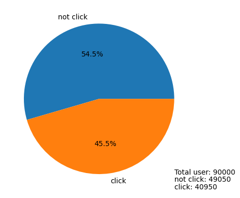
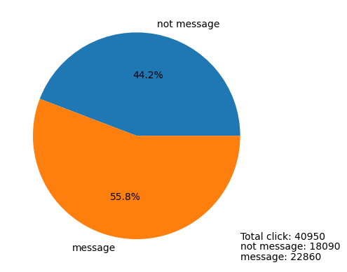
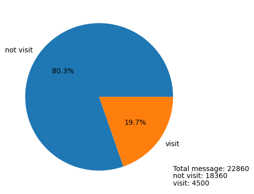
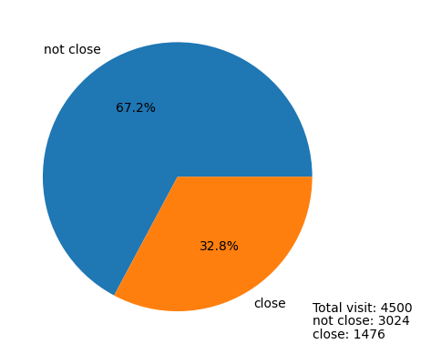
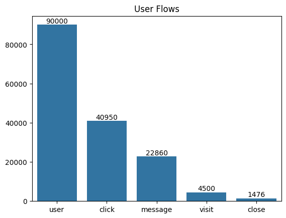

# Portofolio: Funnel Analysis - Improving Ad Relevance, CPM, and Direct Message Effectiveness

# Business Understanding

## Introduction

The Team marketing has conducted a marketing strategy using discount 99% for first month after sign up in fitness center to attract new customers. This customer acquisition strategy used the top five popular social media platform. Our main goal for this analysis is to know how much the cost per acquisition using funnel analysis. Few things we need to know:
- The CPM: IDR65.000
- Impression: 990.000


```python
cpm = 65000
```

## Objectives

There are metrics and KPI we need to calculate, like:
- Impression per click
- Total user reach
- Impression per user
- User per click
- Click per message
- Message per visit
- Visit per closing
- cost per acquisition

## Tools and Dataset Needed

The tools need for this analysis is Python Interpreter, Python library(numpy, pandas, matplotlib, seaborn), JupyterLab. We use the fitness acquisition csv dataset for this analysis. This dataset has four variables and those are id, platform, date, and action during the date.

## Methodology

We will use AIDA concept for this analysis with some modification to fit the problem. It's AIDCA (Awareness, Interest, Desire, Conviction, and Action). In this dataset, the action variables follow this term:
- Awareness = Impression
- Interest = Click
- Desire = Message(DM)
- Conviction = Visit
- Action = Closing

```
impression per click = total impression / total click

impression per user = total impression / total user

user per click = total user / total click

click per message = total click / total direct message

message per visit = total direct message / total visit store

visit per close = total users visit store / total close
where close means purchase or subscribe

cost per acquisition = (cost per mile / 1000) * impression / total close
```

# Data Understanding

## Data Acquisition


```python
# load library
import numpy as np
import pandas as pd
import matplotlib.pyplot as plt
import seaborn as sns
```


```python
dataset = pd.read_csv('data/fitness_acquisition.csv')
```


```python
print(dataset.head())
```

            id   platform        date      action
    0  1000001  instagram  2024-01-03  impression
    1  1000004   facebook  2024-01-01  impression
    2  1000006   linkedin  2024-01-04  impression
    3  1000007  instagram  2024-01-04  impression
    4  1000008   facebook  2024-01-01  impression
    

## Data Profiling


```python
# dataset info
dataset.info()
```

    <class 'pandas.core.frame.DataFrame'>
    RangeIndex: 1059786 entries, 0 to 1059785
    Data columns (total 4 columns):
     #   Column    Non-Null Count    Dtype 
    ---  ------    --------------    ----- 
     0   id        1059786 non-null  int64 
     1   platform  1059786 non-null  object
     2   date      1059786 non-null  object
     3   action    1059786 non-null  object
    dtypes: int64(1), object(3)
    memory usage: 32.3+ MB
    


```python
# missing values
dataset.isna().sum()
```


    id          0
    platform    0
    date        0
    action      0
    dtype: int64


```python
# duplicated values
dataset.duplicated().sum()
```


    np.int64(679203)


This problem maybe happens because some records happen twice or more.


```python
# correct wrong format
dataset['date'] = pd.to_datetime(dataset['date'])
```


```python
dataset['id'] = dataset['id'].astype(int).astype(str)
```


```python
dataset.info()
```

    <class 'pandas.core.frame.DataFrame'>
    RangeIndex: 1059786 entries, 0 to 1059785
    Data columns (total 4 columns):
     #   Column    Non-Null Count    Dtype         
    ---  ------    --------------    -----         
     0   id        1059786 non-null  object        
     1   platform  1059786 non-null  object        
     2   date      1059786 non-null  datetime64[ns]
     3   action    1059786 non-null  object        
    dtypes: datetime64[ns](1), object(3)
    memory usage: 32.3+ MB
    

## Descriptive Statistics


```python
print(dataset.describe(include='all'))
```

                 id  platform                           date      action
    count   1059786   1059786                        1059786     1059786
    unique    90000         5                            NaN           5
    top     1075685  facebook                            NaN  impression
    freq         38    381834                            NaN      990000
    mean        NaN       NaN  2024-01-02 12:52:52.661649408         NaN
    min         NaN       NaN            2024-01-01 00:00:00         NaN
    25%         NaN       NaN            2024-01-02 00:00:00         NaN
    50%         NaN       NaN            2024-01-03 00:00:00         NaN
    75%         NaN       NaN            2024-01-04 00:00:00         NaN
    max         NaN       NaN            2024-01-12 00:00:00         NaN
    


```python
dataset['id'].value_counts()
```


    id
    1075685    38
    1023730    37
    1099075    37
    1057861    37
    1040609    36
               ..
    1023677     1
    1023674     1
    1000077     1
    1048965     1
    1099943     1
    Name: count, Length: 90000, dtype: int64


```python
dataset['platform'].value_counts()
```


    platform
    facebook     381834
    instagram    255000
    linkedin     185359
    tiktok       172411
    youtube       65182
    Name: count, dtype: int64


```python
dataset['date'].value_counts().sort_index()
```


    date
    2024-01-01    260299
    2024-01-02    263376
    2024-01-03    264100
    2024-01-04    264436
    2024-01-05      3131
    2024-01-06       641
    2024-01-07      1066
    2024-01-08      1099
    2024-01-09       988
    2024-01-10       520
    2024-01-11       121
    2024-01-12         9
    Name: count, dtype: int64


We can see that the platform advertises on the first four days.


```python
dataset['action'].value_counts()
```


    action
    impression    990000
    click          40950
    message        22860
    visit           4500
    close           1476
    Name: count, dtype: int64


# Data Preprocessing


```python
def ratio(x,y):
    """
    x per y
    """
    result = x/y 
    return result
```


```python
def pie(a, b, a_label, b_label, caption):
    plt.pie(
        x=[(a-b), 
           b], 
        autopct='%1.1f%%', 
        labels=[a_label,
                b_label])
    plt.text(x=1, y=-1, s=f"{caption}: {int(a)}")
    plt.text(x=1, y=-1.1, s=f"{a_label}: {int(a-b)}")
    plt.text(x=1, y=-1.2, s=f"{b_label}: {int(b)}")

    plt.show()
```


```python
pivot_table = dataset.pivot_table(
    columns='action',
    index='id', 
    values='date', 
    aggfunc='count')[['impression',
                    'click',
                    'message',
                    'visit',
                    'close']]
```


```python
print(pivot_table.head())
```

    action   impression  click  message  visit  close
    id                                               
    1000001         5.0    1.0      NaN    NaN    NaN
    1000004        24.0    1.0      1.0    NaN    NaN
    1000006         6.0    NaN      NaN    NaN    NaN
    1000007        19.0    NaN      NaN    NaN    NaN
    1000008        12.0    1.0      1.0    1.0    1.0
    


```python
impression = pivot_table['impression'].sum()
user = len(pivot_table.index)
click = pivot_table['click'].sum()
message = pivot_table['message'].sum()
visit = pivot_table['visit'].sum()
close = pivot_table['close'].sum()
```

# Modeling


```python
pie(user, click, a_label='not click', b_label='click', caption='Total user')
```


    

    


```python
pie(click, message, a_label='not message', b_label='message', caption='Total click')
```


    

    


```python
pie(message, visit, 'not visit', 'visit', 'Total message')
```


    

    


From 22860 direct message, only 19.7% potential customers decide to visit. We can improve the marketing strategy around this area.


```python
pie(visit, close, 'not close', 'close', 'Total visit')
```


    

    


```python
value = [user, click, message, visit, close]
label = ['user', 'click', 'message', 'visit', 'close']

figure = sns.barplot(x=label, y=value)
figure.bar_label(figure.containers[0])
plt.title('User Flows')
plt.show()
```


    

    


```python
print(f"We have {impression} impressions.")
print(f"Users see the ads about {ratio(impression, user).round(2)} times to click the ads (if interested).")
print(f"The total user reach is {user} users.")
print(f"To get one click, we need to have more less {ratio(impression, click).round(2)} impressions.")
print(f"We need to have more less {ratio(user, click).round(2)} users to get one click.")
print(f"To get one direct message, we need to have more less {ratio(click, message).round(2)} clicks.")
print(f"To get one visitor, we need to have more less {ratio(message, visit).round(2)} direct messages.")
print(f"To get one registration for trial fitness, we need to have more less {ratio(visit, close).round(2)} visitors.")
```

    We have 990000.0 impressions.
    Users see the ads about 11.0 times to click the ads (if interested).
    The total user reach is 90000 users.
    To get one click, we need to have more less 24.18 impressions.
    We need to have more less 2.2 users to get one click.
    To get one direct message, we need to have more less 1.79 clicks.
    To get one visitor, we need to have more less 5.08 direct messages.
    To get one registration for trial fitness, we need to have more less 3.05 visitors.
    

CPM or cost per mile means the cost for every 1000 impressions and it cost IDR65.000 perform one CPM campign. We have 990000 impressions. We need to divide 65000 by 1000 to get the price for one impression.


```python
price_per_impression = 65000/1000
```


```python
cost = impression*price_per_impression
```


```python
cost_per_acquisition = cost/close
```


```python
print(f"The price for one impression: {price_per_impression} IDR.")
print(f"The total cost for the campign: {cost} IDR.")
print(f"The cost to acquire one customer registration: {cost_per_acquisition.round()} IDR.")
```

    The price for one impression: 65.0 IDR.
    The total cost for the campign: 64350000.0 IDR.
    The cost to acquire one customer registration: 43598.0 IDR.
    

# Insights

## Interpretation and Reporting

- It needs 11 impression for one click. This means the ad maybe not enough interesting or relevant for the targeted audience.
- The cost per acquisition is IDR43.598. We need to see from many perspectives. If the CPA is still lower than the margin profit, it is still profitable. If the CPA is higher than the margin profit but the customer lifetime value can cover the CPA, it is still profitable. If not, this shows that you need to optimize the campign to decrease the acquisition cost.
- There are 19.7% visitors from after they direct message through social media. There are big potential to improve the interaction to customers using direct message.
- From 4500 visitors, 32.8% of them decide to register for trial in the fitness center. This is ok situation but still there are space for improvement.

## Action

- Improve ad relevance:
  - Research more about the audience to understand their interest and needs.
  - Test various types of ad to see which one is more effective.
  - Make more relevant and interested ads for our targeted audience.

- Optimize cost per mile (CPM):
  - Review the marketing strategy to get lower cost per mile.
  - Use more specific and relevant keywords for targeting right audience.
  - Retargeting our audience (If needed).

- Develop direct message:
  - Personalized direct message based on their personal information.
  - Give interesting and relevant offer to our potential customers in direct message.
  - Use clear and persuasive language to boost conversion.

# Further Analysis

- Survival analysis to understand the customer lifetime value.
- A/B testing to test various elements in the campign to see which element is more effective.
- Classification analysis to predict what kind of customers will click the ads or not.
