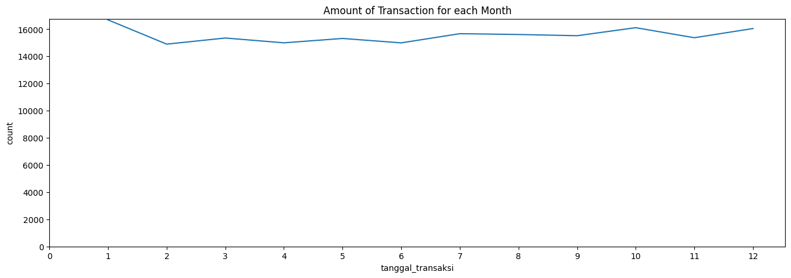
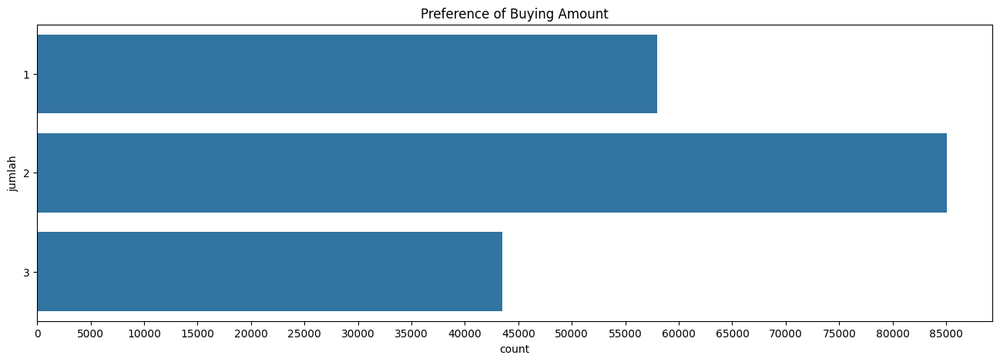
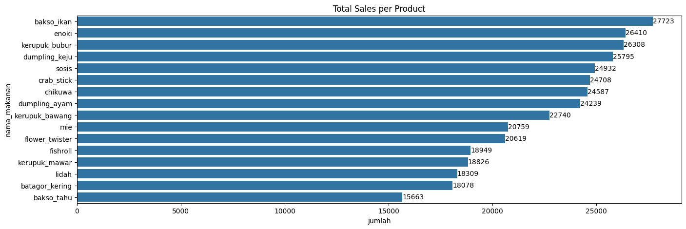
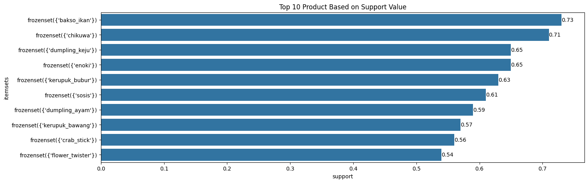

# Portofolio: Market Basket Analysis - Maximize Sales by Understanding Customer Transaction Patterns

# Business Understanding

## Introduction

Seblak Prasmanan is a type of street food where customers can customize their meals by selecting from a variety of ingredients. The food categories include crisps, noodles, mushrooms, vegetables, and meats. The marketing team aims to develop cross-selling strategies to boost sales.

## Objectives

The objective of this project is to identify product bundles based on transaction frequency.

## Tools and Dataset Needed

The tools required for this project are Python and its libraries, such as mlxtend, numpy, pandas, matplotlib, and seaborn. The dataset needed is a transaction record containing transaction IDs, transaction dates, product names, and quantities of sold products.

## Methodology

The algorithm used in this project is the apriori algorithm. The first step involves setting the minimum support threshold. Support is defined as the percentage of transactions in which a product appears.
- In the first iteration, the support of all products is calculated. Products that meet the minimum support threshold are selected.
- In the second iteration, for the selected products, the support of product pairs purchased together is calculated. Product pairs that meet the minimum support threshold are selected. These product pairs are called itemsets.
- In the n-th iteration, the process follows the same rule as the second iteration. The iteration stops when no more n-product itemsets meet the minimum support threshold.

Several metrics are considered, including support, confidence, and lift.
- Support. As mentioned earlier, support is the frequency of an itemset appearing in the dataset.
- Confidence. Confidence measures the likelihood that another product will be purchased if a certain product is purchased.
- Lift. Lift is used to determine whether the co-occurrence of products is coincidental or not.

# Data Understanding

## Data Acquisition


```python
import datetime as dt
import numpy as np
import pandas as pd
import matplotlib.pyplot as plt
import seaborn as sns
```


```python
dataset = pd.read_csv('data/seblak_transaksi.csv')
```


```python
print(dataset.head())
```

       id_transaksi tanggal_transaksi   nama_makanan  jumlah
    0           897        2024-01-01       fishroll     2.0
    1           897        2024-01-01        chikuwa     2.0
    2           897        2024-01-01  dumpling_keju     1.0
    3           897        2024-01-01     crab_stick     3.0
    4           897        2024-01-01     bakso_ikan     1.0
    

## Data Profiling


```python
# dataset info
dataset.info()
```

    <class 'pandas.core.frame.DataFrame'>
    RangeIndex: 186549 entries, 0 to 186548
    Data columns (total 4 columns):
     #   Column             Non-Null Count   Dtype  
    ---  ------             --------------   -----  
     0   id_transaksi       186549 non-null  int64  
     1   tanggal_transaksi  186549 non-null  object 
     2   nama_makanan       186549 non-null  object 
     3   jumlah             186549 non-null  float64
    dtypes: float64(1), int64(1), object(2)
    memory usage: 5.7+ MB
    


```python
# missing values
dataset.isnull().sum()
```


    id_transaksi         0
    tanggal_transaksi    0
    nama_makanan         0
    jumlah               0
    dtype: int64


```python
# duplicated values
dataset.duplicated().sum()
```


    np.int64(0)


```python
# correct wrong format
dataset['tanggal_transaksi'] = pd.to_datetime(dataset['tanggal_transaksi'])
dataset['jumlah'] = dataset['jumlah'].astype('float64').astype('int32')
```


```python
dataset.info()
```

    <class 'pandas.core.frame.DataFrame'>
    RangeIndex: 186549 entries, 0 to 186548
    Data columns (total 4 columns):
     #   Column             Non-Null Count   Dtype         
    ---  ------             --------------   -----         
     0   id_transaksi       186549 non-null  int64         
     1   tanggal_transaksi  186549 non-null  datetime64[ns]
     2   nama_makanan       186549 non-null  object        
     3   jumlah             186549 non-null  int32         
    dtypes: datetime64[ns](1), int32(1), int64(1), object(1)
    memory usage: 5.0+ MB
    

## Descriptive Statistics


```python
print(dataset.describe())
```

            id_transaksi              tanggal_transaksi         jumlah
    count  186549.000000                         186549  186549.000000
    mean    10172.855116  2024-07-01 16:22:44.437225728       1.922524
    min         1.000000            2024-01-01 00:00:00       1.000000
    25%      5084.000000            2024-03-31 00:00:00       1.000000
    50%     10162.000000            2024-07-03 00:00:00       2.000000
    75%     15261.000000            2024-10-02 00:00:00       2.000000
    max     20356.000000            2024-12-31 00:00:00       3.000000
    std      5872.191954                            NaN       0.733457
    


```python
print(dataset.describe(include='object'))
```

           nama_makanan
    count        186549
    unique           16
    top      bakso_ikan
    freq          14823
    


```python
transaction = len(dataset['id_transaksi'].value_counts())
print('The total transaction:', transaction)
```

    The total transaction: 20356
    

The `tanggal_transaksi` is the Indonesian word for transaction date. We can see the date range is from first of January 2024 until last of December 2024. We can visualize it using lineplot to see the trend over time. The `nama_makanan` is the Indonesian word for food name. It's categorical variable with 16 nominal objects. Barplot is better to visualize it. The `jumlah` is the Indonesian word for amount. It tells how many of product are sold for one transaction. Although it looks like numerical, but it is a categorical variable, they are ordnial objects. We will use barplot as well to visualize it.


```python
plt.figure(figsize=(16,5))
sns.lineplot(dataset['tanggal_transaksi'].dt.month.value_counts().sort_index())
plt.xticks(range(0,12+1))
plt.ylim(0)
plt.title('Amount of Transaction for each Month')
plt.show()
```


    

    


```python
plt.figure(figsize=(16,5))
sns.barplot(dataset['jumlah'].value_counts(), orient='h')
plt.xticks(range(0,90000,5000))
plt.title('Preference of Buying Amount')
plt.show()
```


    

    


```python
plt.figure(figsize=(16,5))
figure = sns.barplot(
    data=dataset[['nama_makanan', 'jumlah']].groupby('nama_makanan').sum().reset_index().sort_values('jumlah', ascending=False),
    y='nama_makanan', 
    x='jumlah',
    orient='h',)
figure.bar_label(figure.containers[0])
plt.title('Total Sales per Product')
plt.show()
```


    

    


# Data Preprocessing

Because we do not need the amount of transaction, we will use transaction id and product variables.


```python
dataset_clean = dataset[['id_transaksi','nama_makanan','jumlah']].copy()
```


```python
crosstab = pd.crosstab(index=dataset_clean['id_transaksi'], columns=dataset_clean['nama_makanan'])
```


```python
print(crosstab.head(15).T)
```

    id_transaksi    1   2   3   4   5   6   7   8   9   10  11  12  13  14  15
    nama_makanan                                                              
    bakso_ikan       1   1   1   0   1   1   1   1   1   1   0   1   1   1   0
    bakso_tahu       1   0   0   1   1   0   0   1   0   1   0   0   1   0   1
    batagor_kering   1   1   1   1   0   0   0   1   0   1   1   0   0   1   1
    chikuwa          1   0   1   1   1   0   0   0   1   1   1   1   1   1   0
    crab_stick       0   1   1   1   1   0   0   1   0   0   1   1   0   1   1
    dumpling_ayam    0   1   0   0   1   1   0   1   1   1   1   1   1   1   1
    dumpling_keju    1   0   1   1   0   1   1   0   0   1   1   1   1   1   1
    enoki            1   1   1   1   1   1   1   0   1   1   1   1   1   0   0
    fishroll         0   1   0   0   1   0   1   1   0   1   1   0   1   1   1
    flower_twister   0   1   0   1   1   0   0   0   0   1   1   1   1   0   1
    kerupuk_bawang   0   1   0   1   0   1   0   0   1   1   0   1   0   0   0
    kerupuk_bubur    0   1   1   1   0   0   0   1   0   0   1   1   1   1   0
    kerupuk_mawar    1   1   1   0   0   1   0   0   1   0   0   0   0   1   1
    lidah            1   0   1   1   1   1   0   1   0   1   0   0   0   1   1
    mie              1   0   0   1   0   0   1   1   1   0   0   1   0   0   0
    sosis            0   1   1   1   1   0   0   0   1   1   0   1   1   0   1
    


```python
def boolean(x):
    if x == 0:
        return False
    elif x == 1:
        return True
```

The `boolean` function is to make binary number into boolean.

# Modeling


```python
# library for association rule mining
from mlxtend.frequent_patterns import apriori, association_rules
```


```python
sup = 0.4
apriori_rule = apriori(crosstab.map(boolean), min_support=sup, use_colnames=True)
print(apriori_rule.sort_values('support', ascending=False).head(10))
```

         support          itemsets
    0   0.728188      (bakso_ikan)
    3   0.708292         (chikuwa)
    6   0.649243   (dumpling_keju)
    7   0.648114           (enoki)
    11  0.629249   (kerupuk_bubur)
    15  0.614856           (sosis)
    5   0.587689   (dumpling_ayam)
    10  0.574671  (kerupuk_bawang)
    4   0.556396      (crab_stick)
    9   0.535567  (flower_twister)
    


```python
plt.figure(figsize=(16,5))
figure = sns.barplot(apriori_rule.sort_values('support', ascending=False).head(10).round(2), y='itemsets', x='support')
figure.bar_label(figure.containers[0])
plt.title('Top 10 Product Based on Support Value')
plt.show()
```


    

    


We see the highest support of itemsets is bakso ikan which is the most popular product, followed by chikuwa.


```python
print(association_rules(
    apriori_rule, 
    num_itemsets=len(crosstab), 
    metric='support', 
    min_threshold=0.45,
    return_metrics=['support', 'confidence', 'lift']).sort_values(['support', 'confidence', 'lift'], ascending=False).round(3))
```

            antecedents      consequents  support  confidence   lift
    1         (chikuwa)     (bakso_ikan)    0.516       0.729  1.001
    0      (bakso_ikan)        (chikuwa)    0.516       0.709  1.001
    2   (dumpling_keju)     (bakso_ikan)    0.474       0.730  1.003
    3      (bakso_ikan)  (dumpling_keju)    0.474       0.651  1.003
    4           (enoki)     (bakso_ikan)    0.471       0.727  0.998
    5      (bakso_ikan)          (enoki)    0.471       0.647  0.998
    7   (kerupuk_bubur)     (bakso_ikan)    0.462       0.734  1.008
    6      (bakso_ikan)  (kerupuk_bubur)    0.462       0.634  1.008
    10  (dumpling_keju)        (chikuwa)    0.460       0.709  1.001
    11        (chikuwa)  (dumpling_keju)    0.460       0.650  1.001
    12          (enoki)        (chikuwa)    0.459       0.708  1.000
    13        (chikuwa)          (enoki)    0.459       0.648  1.000
    9           (sosis)     (bakso_ikan)    0.452       0.735  1.009
    8      (bakso_ikan)          (sosis)    0.452       0.621  1.009
    

# Insights

## Interpretation and Reporting

**Bakso ikan and chikuwa domination:**
- Bakso ikan and chikuwa appear as the most frequent items bought together, with a support of 51.6%. This shows that both are the main products customers order.
- High confidence shows that if one of them is in the basket, there is a high probability that the other item is also in the basket.

**Strong Companion Items:**
- Dumpling keju, enoki, kerupuk bubur, and sosis are also bought together with bakso ikan and chikuwa, showing customer preferences in choosing other toppings.
- High confidence for the items to bakso ikan (consequent) shows that bakso ikan is the most bought item and other items are companion items.

**Lift Ratio Close to 1** shows that items are bought independently but are still often bought together. This indicates that the popularity of the items is quite even.

## Action

**Optimal Bundling Strategy**
- Create a variety of packages that combine bakso ikan and chikuwa with popular companion items.
- For example, a frugal package (bakso ikan, chikuwa, dumpling keju, enoki, and kerupuk bubur).
- And offer the packages with an interesting price rather than items bought separately.

**Strategic Placement of Toppings**
- Arrange the topping display in such a way that bakso ikan and chikuwa are in the most prominent position.
- Place companion items around them to make it easier for customers to take them.
- Give labels for bakso ikan and chikuwa, like "matched pair" or "favorite toppings."

**Targeted Promotion**
- Make promotions for companion items, like "add enoki for only Rp2000."
- Offer one topping extra for free if you buy all toppings or a minimum of Rp35000.
- Give a loyalty program, like one free complete package after getting 10 visit stamps.

# Further Analysis

- Do clustering analysis to segment customers based on their characteristics.
- Conduct causal impact analysis to forecast the sales if the marketing team don't apply the insights market basket analysis.
- Perform regression analysis to predict sales for next couple of months.
