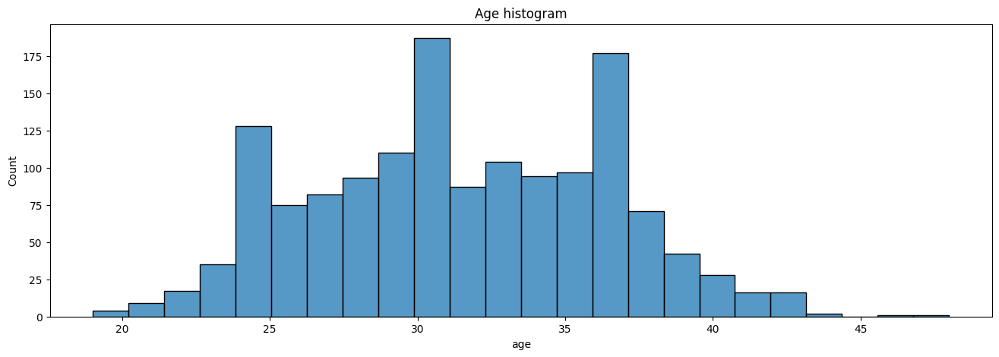
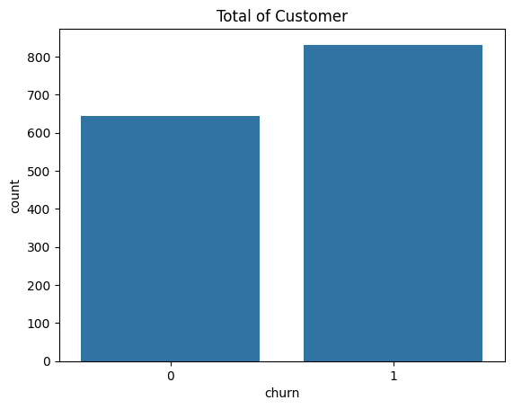

# Portofolio: Survival Analysis - Driving Customer Lifetime Value Growth Through a 29% Reduction in Churn Risk

## Business Understanding

### Introduction

A fitness center offers comprehensive facilities and training programs to help customers achieve their fitness goals. Currently, they are running an attractive promotional program by offering a 99% discount on the first month's membership fee for new sign-ups. The aims of this coupon program is to:
- increase member growth
- increase long term profit
- build a loyal customer

The marketing team wants to know customer lifetime value by understanding how long customers will stop visiting the fitness center using the survival analysis methodology. Churn is a tricky case. Although we say the customer is a churn already, there is still a chance to win back even old customers. Our marketing team definition for churn is if customers don't visit the fitness center in last six months, they assume that the customers are churn. It means, churn is for customers that don't visit for more than six months and not churn is for customers that still visit in last six months.

Information we need to know:
- subscription price: IDR 199.000
- gross profit: 55%
- first month discount: 99%


```python
info = {'price': 199000,
        'gross_profit': 0.55,
        'first_month_discount': 0.99}
```

### Objectives

The aim of this project is to understand:
- the customers behaviour after signup and using their 99% discount on the first month membership,
- how long customer will survive from churn,
- what is the customer lifetime value,
- what is the CLTV:CAC ratio, and
- does age influence the duration of survival.

### Tools and Dataset Needed

The technologies used for this project is Python with its library such as numpy, pandas, matplotlib, seaborn, and lifeliness. The dataset contains few variables like customer_id, first_visit, last_visit, and age.

### Methodology

The survival analysis has some steps to do. All variables we need are time to event where this variable explains how long until the event occurs, target variable where this variable explains whether or not the event occurs until the study ends (it's called right cencored), and other variables that has correlation with the target.

We'll make churn variable by using if logic. 1 if last_visit < (query_time - six months) else 0 where 1 is churn and 0 is not churn. The CLTV formula we adjust for this case:

$$CLTV = {Price * Gross \ Profit * Average \ Lifetime} $$

Where:
- Transaction means customers pays the bill (counted per each month)
- Price is the subscription price
- Gross Profit is a profit after all expenses
- Average Lifetime is the average duration before they do churn.

## Data Understanding

### Data Acquisition


```python
import datetime as dt
import numpy as np
import pandas as pd
import matplotlib.pyplot as plt
import seaborn as sns
import lifelines
```


```python
dataset = pd.read_csv('data/fitness_10-2024.csv')
```


```python
print(dataset.head())
```

       customer_id register_date  last_visit  age
    0         1001    2023-09-29  2023-10-21   27
    1         1007    2023-11-28  2023-12-19   35
    2         1011    2024-02-25  2024-03-20   28
    3         1012    2023-07-30  2023-08-23   22
    4         1033    2023-10-03  2023-10-22   29
    

### Data Profiling


```python
# dataset info
dataset.info()
```

    <class 'pandas.core.frame.DataFrame'>
    RangeIndex: 1476 entries, 0 to 1475
    Data columns (total 4 columns):
     #   Column         Non-Null Count  Dtype 
    ---  ------         --------------  ----- 
     0   customer_id    1476 non-null   int64 
     1   register_date  1476 non-null   object
     2   last_visit     1476 non-null   object
     3   age            1476 non-null   int64 
    dtypes: int64(2), object(2)
    memory usage: 46.3+ KB
    

The register_date and last_visit are still object type, so we will correct it later.


```python
# missing values
dataset.isnull().sum()
```


    customer_id      0
    register_date    0
    last_visit       0
    age              0
    dtype: int64


```python
# duplicated values
dataset.duplicated().sum()
```


    np.int64(0)


```python
# correct wrong format
dataset['register_date'] = pd.to_datetime(dataset['register_date'])
dataset['last_visit'] = pd.to_datetime(dataset['last_visit'])
```


```python
dataset.info()
```

    <class 'pandas.core.frame.DataFrame'>
    RangeIndex: 1476 entries, 0 to 1475
    Data columns (total 4 columns):
     #   Column         Non-Null Count  Dtype         
    ---  ------         --------------  -----         
     0   customer_id    1476 non-null   int64         
     1   register_date  1476 non-null   datetime64[ns]
     2   last_visit     1476 non-null   datetime64[ns]
     3   age            1476 non-null   int64         
    dtypes: datetime64[ns](2), int64(2)
    memory usage: 46.3 KB
    

Now we can see that the register_date and last_visit are already datetime type.

### Descriptive Statistics


```python
dataset['register_date'].value_counts()
```


    register_date
    2023-03-24    12
    2023-05-31    11
    2023-04-24    11
    2023-05-28    11
    2023-07-30    11
                  ..
    2023-01-06     1
    2022-11-28     1
    2022-11-13     1
    2022-12-23     1
    2023-01-03     1
    Name: count, Length: 418, dtype: int64


```python
dataset['last_visit'].value_counts()
```


    last_visit
    2023-12-27    15
    2024-08-25     9
    2024-09-08     9
    2024-09-15     9
    2024-07-29     8
                  ..
    2024-09-18     1
    2024-05-10     1
    2024-04-13     1
    2024-08-11     1
    2024-05-04     1
    Name: count, Length: 416, dtype: int64


```python
print(dataset[['register_date','last_visit','age']].describe(include='all').round(3))
```

                           register_date                     last_visit       age
    count                           1476                           1476  1476.000
    mean   2023-07-03 17:11:13.170732032  2024-03-05 01:28:46.829268224    31.498
    min              2022-11-07 00:00:00            2023-08-02 00:00:00    19.000
    25%              2023-04-22 18:00:00            2023-11-24 00:00:00    28.000
    50%              2023-07-03 00:00:00            2024-03-05 00:00:00    31.000
    75%              2023-09-07 00:00:00            2024-06-23 00:00:00    35.000
    max              2024-03-09 00:00:00            2024-10-01 00:00:00    48.000
    std                              NaN                            NaN     4.927
    

The median and the mean for age are not really far, we can visualize it to see if the age is normally distributed or not.


```python
plt.figure(figsize=(16,5))
sns.boxplot(dataset, x='age', showmeans=True)
plt.title('Age Boxplot')
plt.show()
```


    

    


```python
plt.figure(figsize=(16,5))
sns.histplot(dataset, x='age')
plt.title('Age histogram')
plt.show()
```


    

    


There are three peaks for age variable, age 25, age 30, and age around 37.


```python
# check independent sample
for i in dataset['customer_id'].value_counts():
    if i > 1:
        print('not independent sample detected')
        break
```

The sample are independent and not counted twice.


```python
dataset.info()
```

    <class 'pandas.core.frame.DataFrame'>
    RangeIndex: 1476 entries, 0 to 1475
    Data columns (total 4 columns):
     #   Column         Non-Null Count  Dtype         
    ---  ------         --------------  -----         
     0   customer_id    1476 non-null   int64         
     1   register_date  1476 non-null   datetime64[ns]
     2   last_visit     1476 non-null   datetime64[ns]
     3   age            1476 non-null   int64         
    dtypes: datetime64[ns](2), int64(2)
    memory usage: 46.3 KB
    

## Data Preprocessing


```python
dataset['duration'] = (pd.Series(dataset['last_visit']-dataset['register_date']).dt.days/30).astype('int')
```


```python
print(dataset.head())
```

       customer_id register_date last_visit  age  duration
    0         1001    2023-09-29 2023-10-21   27         0
    1         1007    2023-11-28 2023-12-19   35         0
    2         1011    2024-02-25 2024-03-20   28         0
    3         1012    2023-07-30 2023-08-23   22         0
    4         1033    2023-10-03 2023-10-22   29         0
    

To get duration, we need to subtrack the last_visit with register_date. Some people go to the fitness center once a week, twice a week, or even everyday. We count just one for both who visit everyday and once a week.


```python
dataset.info()
```

    <class 'pandas.core.frame.DataFrame'>
    RangeIndex: 1476 entries, 0 to 1475
    Data columns (total 5 columns):
     #   Column         Non-Null Count  Dtype         
    ---  ------         --------------  -----         
     0   customer_id    1476 non-null   int64         
     1   register_date  1476 non-null   datetime64[ns]
     2   last_visit     1476 non-null   datetime64[ns]
     3   age            1476 non-null   int64         
     4   duration       1476 non-null   int64         
    dtypes: datetime64[ns](2), int64(3)
    memory usage: 57.8 KB
    


```python
print(dataset.describe())
```

           customer_id                  register_date  \
    count  1476.000000                           1476   
    mean   1738.500000  2023-07-03 17:11:13.170732032   
    min    1001.000000            2022-11-07 00:00:00   
    25%    1369.750000            2023-04-22 18:00:00   
    50%    1738.500000            2023-07-03 00:00:00   
    75%    2107.250000            2023-09-07 00:00:00   
    max    2476.000000            2024-03-09 00:00:00   
    std     426.228812                            NaN   
    
                              last_visit          age     duration  
    count                           1476  1476.000000  1476.000000  
    mean   2024-03-05 01:28:46.829268224    31.497967     7.644986  
    min              2023-08-02 00:00:00    19.000000     0.000000  
    25%              2023-11-24 00:00:00    28.000000     4.000000  
    50%              2024-03-05 00:00:00    31.000000     7.000000  
    75%              2024-06-23 00:00:00    35.000000    13.000000  
    max              2024-10-01 00:00:00    48.000000    19.000000  
    std                              NaN     4.926923     5.336156  
    


```python
plt.figure(figsize=(16,5))
sns.boxplot(x=dataset['duration'], showmeans=True)
plt.xticks(range(0,(dataset['duration'].max()+1)))
plt.title('Box Plot of Duration in Month')
plt.show()
```


    

    


```python
plt.figure(figsize=(16,5))
sns.histplot(dataset['duration'], bins=19)
plt.xticks(range(0,(dataset['duration'].max()+1)))
plt.title('Histogram of Duration in Month')
plt.show()
```


    

    


We still don't know yet they churn or not. What we know already is we have three peaks, the majority duration is one month, followed by 12 months and 6 months. If we remember the marketing team strategy, I guess that this one month duration group is the group that signed up to get the discount first month and then churn.

We query the dataset on '2024-10-01'. So, the churn statement point is '2024-04-01'. Last visit before churn statement point will count as churn.


```python
def churn(x):
    if pd.Timestamp(x) < pd.Timestamp('2024-04-01'):
        return 1
    else:
        return 0
```


```python
dataset['churn'] = dataset['last_visit'].apply(churn)
```


```python
print(dataset)
```

          customer_id register_date last_visit  age  duration  churn
    0            1001    2023-09-29 2023-10-21   27         0      1
    1            1007    2023-11-28 2023-12-19   35         0      1
    2            1011    2024-02-25 2024-03-20   28         0      1
    3            1012    2023-07-30 2023-08-23   22         0      1
    4            1033    2023-10-03 2023-10-22   29         0      1
    ...           ...           ...        ...  ...       ...    ...
    1471         2462    2023-06-10 2024-08-21   33        14      0
    1472         2465    2022-12-29 2024-05-11   41        16      0
    1473         2467    2023-07-27 2024-09-14   39        13      0
    1474         2473    2023-02-13 2024-04-02   40        13      0
    1475         2474    2023-01-03 2024-04-29   37        16      0
    
    [1476 rows x 6 columns]
    


```python
sns.barplot(dataset.churn.value_counts())
plt.title('Total of Customer')
plt.show()
```


    

    


```python
dataset_clean = dataset[['age','duration','churn']].copy()
```

## Modeling

### Kaplan Meier Fitter Modelling


```python
kmf = lifelines.KaplanMeierFitter()
```


```python
kmf.fit(durations=dataset_clean['duration'],
        event_observed=dataset_clean['churn'])
```


    <lifelines.KaplanMeierFitter:"KM_estimate", fitted with 1476 total observations, 645 right-censored observations>


```python
plt.figure(figsize=(16,5))
kmf.plot()
plt.xticks(range(0,(dataset_clean['duration'].max()+1)))
plt.xlabel('duration in month')
plt.ylabel('survival probability')
plt.axhline(y=0.5, c='y', linestyle='--')
plt.axvline(x=kmf.median_survival_time_, c='r', linestyle='--')
plt.title('Kaplan Meier Curve for survival Rate by Month')
plt.show()
```


    

    


We can see on duration 0, the survival probability did not start from 100%. It means the customers did not even extend for first month. After getting the 99% discount, they decided not to continue subscribing fitness center.

The median lifetime lies on the month 7. It means, customers stop subscribing around month 7 after signing up.


```python
print(kmf.event_table)
```

              removed  observed  censored  entrance  at_risk
    event_at                                                
    0.0           271       271         0      1476     1476
    1.0             8         8         0         0     1205
    2.0            20        19         1         0     1197
    3.0            62        62         0         0     1177
    4.0           114       114         0         0     1115
    5.0           122       122         0         0     1001
    6.0           124       124         0         0      879
    7.0            73        71         2         0      755
    8.0            27        27         0         0      682
    9.0            23        12        11         0      655
    10.0           28         0        28         0      632
    11.0           88         1        87         0      604
    12.0          134         0       134         0      516
    13.0          130         0       130         0      382
    14.0          117         0       117         0      252
    15.0           71         0        71         0      135
    16.0           40         0        40         0       64
    17.0           16         0        16         0       24
    18.0            7         0         7         0        8
    19.0            1         0         1         0        1
    

From total 1476 customers, 271 customers of them stop subscribing after getting the discount 99%.


```python
plt.figure(figsize=(16,5))
sns.barplot(y=kmf.event_table.observed, x=kmf.event_table.index, label='churn')
sns.barplot(y=kmf.event_table.censored, x=kmf.event_table.index, label='not churn')
plt.xlabel('duration in month')
plt.xticks(range(0,(dataset_clean['duration'].max()+1)))
plt.legend()
plt.title('Histogram of Duration in Month by Churn')
plt.show()
```


    

    


Month 0 with blue color has the most churn customers, followed by month 6. We see that after month 9 is cencored data which means they dont count as churn.


```python
info
```


    {'price': 199000, 'gross_profit': 0.55, 'first_month_discount': 0.99}


### CLTV Calculation

Regardless of ad cost, the Discount Cost would be like:

$$DC = ((1 - Gross \ Profit) * Price) - ((1 - First \ Month \ Discount) * Price)$$

I use Average Lifetime Customers as a parameter. But, because the duration is not normally distributed, I decide to use median, instead. We also don't use average customer order because we know already that the customer only purchase every month which we can just need the median of customer lifetime. The Customer Lifetime Value calculation would be:

$$CLTV = Price * Gross \ Profit * Median \ Lifetime$$


```python
dc = (((1-info['gross_profit'])*info['price'])-((1-info['first_month_discount'])*info['price']))
```


```python
cltv = (info['price'] * info['gross_profit'] * (kmf.median_survival_time_-1))
```


```python
print(f"The Discount Cost: {int(dc)} IDR")
print(f"The Customer Lifetime Value: {int(cltv)} IDR")
print(f"The CLTV Ratio: {(cltv/dc).round(3)}")
```

    The Discount Cost: 87559 IDR
    The Customer Lifetime Value: 656700 IDR
    The CLTV Ratio: 7.5
    

### cltv ratio

The customer lifetime value is simply a value that contributes to the profit of the company. This means, the price multiply by the gross profit and multiply by median lifetime. The standard ratio for CLTV is 3:1. In this case, the ratio is 7.5 which is very healthy for the company.

Note: in CLTV formula, we subtract one for the median lifetime because that is counted as the discount. So, the real median lifetime is 6 months.

### Cox Proportional Hazard Modelling

The CoxPHFitter is the module to analyze what factors contribute the most to the churn customers.


```python
cox = lifelines.CoxPHFitter()
cox.fit(df=dataset_clean, duration_col='duration', event_col='churn')
```


    <lifelines.CoxPHFitter: fitted with 1476 total observations, 645 right-censored observations>


```python
cox.print_summary(style='ascii')
```

    <lifelines.CoxPHFitter: fitted with 1476 total observations, 645 right-censored observations>
                 duration col = 'duration'
                    event col = 'churn'
          baseline estimation = breslow
       number of observations = 1476
    number of events observed = 831
       partial log-likelihood = -5056.16
             time fit was run = 2025-02-08 15:39:22 UTC
    
    ---
               coef exp(coef)  se(coef)  coef lower 95%  coef upper 95% exp(coef) lower 95% exp(coef) upper 95%
    covariate                                                                                                  
    age       -0.35      0.71      0.01           -0.37           -0.33                0.69                0.72
    
               cmp to      z      p  -log2(p)
    covariate                                
    age          0.00 -34.52 <0.005    864.84
    ---
    Concordance = 0.88
    Partial AIC = 10114.32
    log-likelihood ratio test = 1420.61 on 1 df
    -log2(p) of ll-ratio test = 1030.32
    
    

There are so many things we can see but we will focus what's really important. From 1476 customers, we observed 831 customers that they do churn.

Coef uses logarithm so it's hard to interpret. But we see the minus in age coefficient which means everytime the age is increasing, the risk is getting decreasing, and vice versa. We use the exponential coefficient normalize the logarithm.

The exp(coef) is 0.71 which is smaller than 1. That means if the customer age is one year older, the risk or churn is (1-0.71= 0.29) 29% smaller than the younger customers. The P-value is less than 0.05 which means the variable age has a significant effect on duration of customer churn. The concordance says 0.88 or 88% which means the correlation coefficient is very well to predict the duration of churn using the model.


```python
plt.figure(figsize=(16,5))
sns.regplot(dataset_clean, x='duration', y='age')
plt.xticks(range(0,(dataset_clean['duration'].max()+1)))
plt.title('Scatter Plot of Duration by Age')
plt.show()
```


    

    


## Insights

### Interpretation and Reporting
- 271 customers from 1476 decide not to continue the subscription.
- Because the duration is not normally distributed, we use non-parametric statistical technique which is Kaplan Meier method. The median of customer lifetime is 7 months or 6 months after one month discount. So, we just counted it as 6 months.
- The ratio of CLTV is 7.5 which is very good performance.
- The exponentiated coefficient (exp(coef)) for age was 0.71, indicating that for each one-year increase in customer age, the risk of churn decreased by 29% (1 - 0.71).
- This effect was statistically significant (p < .05).
- The model demonstrated good predictive ability, as indicated by a concordance statistic of 0.88.

### Action

**Focus on retention for new customers**
- Insight: 6 months are the median lifetime customers. Customers stop subscribing even before one year.
- Action:
  - Do proactive communication with new customers to ensure that they get the value from the products or services.
  - Enhance customer retention strategy on first month to prevent churn after median lifetime.

**Customer age segmentation**
- Insight: Churn risk decreases about 29% when the customer is one year older than other customers. This means, older customers are more loyal.
- Action:
  - Focus on retention and marketing strategy for younger group because they are high risk to do churn.
  - Maintain services quality and give rewards for their loyalty like exclusive discount for older group.

**Enhance customer lifetime value**
- Insight: The ratio is 7.5 which is a very good performance.
- Action: Maintain or boost CLTV by doing up-selling or cross-selling relevant products.

**Optimize predictive model for churn**
- Insight: The model has a good statistic corcondance about 0.88.
- Action:
  - Use the model to predict which customers have high risk churn before they really do it.
  - Proactive churn intervention like offer additional services.

### Further Analysis
- Perform A/B testing to test effectiveness of retention strategy.
- Conduct Funnel analysis to get customer acquisition cost.
- Do clustering analysis to segment customers based on their characteristics.


```python

```


```python

```
